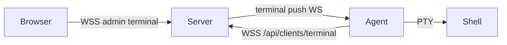

# Project Overview — P8 WebSSH Harden

最后更新：2026-07-15 20:30

## Preliminary Direction

在 **已完成 terminal 接线 + us1 E2E** 的基础上，完成 WebSSH 硬化：deflate 自动降级、exec 门闩拆分、terminal 限流/空闲超时、能力广告、server 强制 2FA、Release 双资产。

## Current Architecture



| 层 | 仓库 | 角色 |
|----|------|------|
| Server | `tokendance-komari` | 会话、2FA、转发 |
| Agent | `komari-agent-rs` | PTY、WS 控制面、压缩 |
| Edge | `tokendance-deploy` nginx | Upgrade 头（已修） |

## Technology Stack

| Layer | Current | Target (P8) |
|-------|---------|-------------|
| Agent lang | Rust 2024, sync | 同左 |
| WS codec | 手写 RFC6455 + 手写 deflate | deflate 失败自动关压缩 |
| Features | `terminal` optional | 默认仍 off；full 发布 |
| Server auth | 未绑 2FA 放行敏感操作 | **强制 enrollment** |

## Entry Points

- Agent: `server/reconnection.rs` tick + terminal dispatch
- Server: `RequireSensitive2FA` → `RequestTerminal`

## Build & Run

```bash
cargo test --features terminal
cargo build --release --features full
# release: tag v* → CI default + full linux musl assets
```

## Testing Baseline

- Agent: 230+ unit tests；P8 新增 `p8_tests`
- Server: `web/api` 新增 `AuthSensitive_test.go`
- E2E: us1 已人工/脚本验证（见 runbook）

## Project Governance Baseline

- `AGENTS.md` / `CLAUDE.md`（agent-rs）
- server: `projects/komari/STATE.md` + `docs/runbooks/komari-webshell.md`
- Tracking: **GITHUB_STANDARD**（无 project scope）

## External Integrations

Komari server WSS、nginx status、Azure PG（server only）
