# Komari-Agent-RS: Dependency Graph &amp; S.U.P.E.R Compliance Analysis

**Generated**: 2026-06-20
**Source documents**: `docs/plan/phased-implementation-plan.md`, `docs/plan/architecture-reference.md`, `docs/analysis/module-inventory.md`, `docs/analysis/chatgpt-architecture-advice.md`
**Target**: Go `komari-agent-go` (~6,555 lines, 10 modules) → Rust `komari-agent-rs` (~4,900 lines, ~80 files in 12 modules)
**Core principle**: Sync single-threaded, zero-allocation hot path, explicit config passing (no globals).

---

## 1. Full Mermaid Dependency Graph

Nodes are color-coded by implementation phase. Edges represent compile-time `mod`/`use` dependencies (not runtime call order). Solid edges = hard dependency; dashed edges = conditional (`cfg`-gated or feature-gated).

```mermaid
graph TB
    %% ── PHASE 1: Foundation ──
    subgraph P1["🔵 Phase 1: Foundation (~600 lines)"]
        direction TB
        main["main.rs<br/>Entry point"]
        app["app.rs<br/>CLI dispatch"]
        config["config.rs<br/>Config struct<br/>clap derive"]
        crypto["crypto.rs<br/>SHA-1 + base64<br/>self-implemented"]
        json["json.rs<br/>JsonBuf + Field<br/>+ EncodeJson trait"]
        tls["tls.rs<br/>rustls ClientConfig"]
        ws["ws.rs<br/>WS connect + handshake"]
        http_stub["http.rs<br/>HTTP POST stub"]
        v2["protocol/v2.rs<br/>JSON-RPC 2.0 types"]
        v1["protocol/v1.rs<br/>V1 types"]
        pmod["protocol/mod.rs<br/>Re-exports"]
        srv_stub["server/mod.rs<br/>Initial run() stub"]
        cargo["Cargo.toml<br/>.cargo/config.toml"]
        ci[".github/workflows/ci.yml"]
    end

    %% ── PHASE 2: Linux Metrics ──
    subgraph P2["🟢 Phase 2: Linux Metrics (~750 lines)"]
        direction TB
        arena["arena.rs<br/>ScratchArena + SmallVec"]
        plat_mod["platform/mod.rs<br/>cfg-gated type aliases"]
        plat_linux["platform/linux.rs<br/>Module gate"]
        mon_mod["monitor/mod.rs<br/>Monitor + tick()"]
        cpu_linux["monitor/cpu/linux.rs<br/> /proc/stat + /proc/cpuinfo"]
        mem_linux["monitor/mem/linux.rs<br/>3-mode /proc/meminfo"]
        disk_linux["monitor/disk/linux.rs<br/>30+ exclude filter"]
        net_linux["monitor/net/linux.rs<br/> /proc/net/dev + /proc/net/tcp"]
        load_linux["monitor/load/linux.rs<br/> /proc/loadavg"]
        conn_linux["monitor/connections/linux.rs<br/>TCP/UDP counts"]
        proc_linux["monitor/process/linux.rs<br/>PID counting"]
        uptime_linux["monitor/uptime/linux.rs<br/> /proc/uptime"]
        ip_linux["monitor/ip/linux.rs<br/>Netlink + HTTP fallback"]
    end

    %% ── PHASE 3: Protocol FSM ──
    subgraph P3["🟡 Phase 3: Protocol FSM (~500 lines)"]
        direction TB
        fsm["protocol/fsm.rs<br/>FallbackFsm<br/>+ ConnectionFsm"]
        backoff["server/backoff.rs<br/>Exponential + jitter"]
        recon["server/reconnection.rs<br/>Reconnection loop"]
        http_full["http.rs<br/>Full HTTP/1.1 POST"]
        task_stub["server/task.rs<br/>Stub exec + ping"]
        srv_p3["server/mod.rs<br/>FSM + backoff integration"]
    end

    %% ── PHASE 4: Cross-Platform ──
    subgraph P4["🟣 Phase 4: Cross-Platform (~1,535 lines)"]
        direction TB
        plat_win["platform/windows.rs"]
        plat_mac["platform/macos.rs"]
        plat_fbsd["platform/freebsd.rs"]
        cpu_all["monitor/cpu/{win,mac,fbsd}<br/>4-platform CPU"]
        mem_all["monitor/mem/{win,mac,fbsd}<br/>4-platform memory"]
        disk_all["monitor/disk/{win,mac,fbsd}<br/>4-platform disk"]
        net_all["monitor/net/{win,mac,fbsd}<br/>4-platform network"]
        gpu_mod["monitor/gpu/mod.rs<br/>GpuDetector dispatch"]
        gpu_all["monitor/gpu/{linux,win,mac,fbsd}<br/>nvidia-smi/DXGI/system_profiler"]
        os_detect["monitor/os.rs<br/>OS name + kernel"]
        virt["monitor/virtualization.rs<br/>VM/container detection"]
    end

    %% ── PHASE 5: Terminal + Ping + Tools ──
    subgraph P5["🔴 Phase 5: Terminal + Ping + Tools (~1,045 lines)"]
        direction TB
        gzip["gzip.rs<br/>Fixed-Huffman encoder"]
        dns_full["dns.rs<br/>Full custom resolver"]
        term_mod["terminal/mod.rs<br/>Terminal trait"]
        term_unix["terminal/unix.rs<br/>posix_openpt PTY"]
        term_win["terminal/windows.rs<br/>ConPTY"]
        ping_icmp["server/ping_icmp.rs<br/>ICMP raw socket"]
        ping_tcp["server/ping_tcp.rs<br/>TCP connect"]
        ping_http["server/ping_http.rs<br/>HTTP round-trip"]
        cf_access["server/cf_access.rs<br/>Cloudflare headers"]
        task_types["task.rs<br/>ExecTask + PingTask"]
        task_full["server/task.rs<br/>Real impl"]
        update["update.rs<br/>GitHub self-update"]
        integ["tests/integration.rs<br/>Full lifecycle"]
    end

    %% ── PHASE 6: Polish ──
    subgraph P6["🟠 Phase 6: Polish (~510 lines)"]
        direction TB
        netstatic["monitor/netstatic.rs<br/>Traffic history"]
        autodisc["autodiscovery.rs<br/>Auto-registration"]
        win_toast["platform/windows_toast.rs<br/>Toast notifications"]
        scripts["scripts/install.sh<br/>scripts/install.ps1"]
        docs["README.md + docs/"]
    end

    %% ── CROSS-PHASE EDGES ──

    %% P1 internal
    main --> app
    app --> config
    app --> srv_stub
    srv_stub --> ws
    srv_stub --> pmod
    ws --> tls
    ws --> crypto
    v2 --> json
    v1 --> json
    pmod --> v2
    pmod --> v1

    %% P2 depends on P1
    mon_mod --> arena
    mon_mod --> json
    mon_mod --> plat_mod
    cpu_linux --> mon_mod
    mem_linux --> mon_mod
    disk_linux --> mon_mod
    net_linux --> mon_mod
    load_linux --> mon_mod
    conn_linux --> mon_mod
    proc_linux --> mon_mod
    uptime_linux --> mon_mod
    ip_linux --> mon_mod
    plat_mod --> plat_linux
    srv_stub -.-> mon_mod

    %% P3 depends on P1+P2
    fsm --> v2
    fsm --> v1
    recon --> backoff
    recon --> fsm
    http_full --> tls
    http_full --> json
    task_stub --> v2
    task_stub --> task_types
    srv_p3 --> recon
    srv_p3 --> http_full
    srv_p3 --> task_stub
    srv_p3 -.-> mon_mod

    %% P4 depends on P1+P2
    cpu_all -.-> mon_mod
    mem_all -.-> mon_mod
    disk_all -.-> mon_mod
    net_all -.-> mon_mod
    gpu_mod -.-> mon_mod
    gpu_all --> gpu_mod
    os_detect -.-> mon_mod
    virt -.-> mon_mod
    plat_mod --> plat_win
    plat_mod --> plat_mac
    plat_mod --> plat_fbsd

    %% P5 depends on P1-P4
    gzip --> json
    dns_full --> config
    term_mod --> term_unix
    term_mod --> term_win
    ping_icmp --> dns_full
    ping_tcp --> dns_full
    ping_http --> dns_full
    cf_access --> ws
    cf_access --> http_full
    task_full --> ping_icmp
    task_full --> ping_tcp
    task_full --> ping_http
    task_full --> term_mod
    update --> dns_full
    update --> config
    integ --> srv_p3
    integ --> mon_mod

    %% P6 depends on P1-P5
    netstatic -.-> net_all
    netstatic --> json
    autodisc --> config
    autodisc --> os_detect
    win_toast --> config
    srv_p3 -.-> autodisc
    srv_p3 -.-> netstatic
```



### Phase Color Legend

| Color | Phase | Name | Lines | Key Output |
|-------|-------|------|-------|-----------|
| 🔵 Blue | P1 | Foundation + Handshake | 600 | TLS WS connect, static heartbeat, CI green on 4 OS |
| 🟢 Green | P2 | Linux Metrics + Zero-Alloc | 750 | Full Linux monitoring, ScratchArena, RSS < 3 MB |
| 🟡 Yellow | P3 | Protocol FSM + Fallback | 500 | 3-strike v2→v1 fallback, exponential backoff |
| 🟣 Purple | P4 | Cross-Platform Metrics | 1,535 | Windows/macOS/FreeBSD collectors, GPU, OS, virt |
| 🔴 Red | P5 | Terminal + Ping + Tools | 1,045 | PTY/ConPTY, ICMP/TCP/HTTP ping, gzip, DNS, self-update |
| 🟠 Orange | P6 | Polish + Packaging | 510 | Netstatic, autodiscovery, install scripts, docs |

---

## 2. Critical Path Listing

The critical path is the longest chain of sequentially-dependent phases that cannot be parallelized. It determines minimum delivery time.

### 2.1 Phase-Level Critical Path

```
P1 (Foundation)
  │  600 lines, 2-3 days
  │  No parallel alternatives — everything depends on config, crypto, json, ws.
  ▼
P2 (Linux Metrics)
  │  750 lines, 4-5 days
  │  Depends on P1 for encoding + server skeleton.
  ▼
P3 (Protocol FSM)
  │  500 lines, 3-4 days
  │  Depends on P2 for monitor tick loop that FSM wraps.
  ▼
P5 (Terminal + Ping + Tools)
  │  1,045 lines, 6-8 days
  │  Depends on P3 for protocol dispatch, P4 for platform types.
  ▼
P6 (Polish + Packaging)
    510 lines, 2-3 days
    Depends on P5 for full integration test.
```

**Critical path duration**: 17-23 days (single developer, serial).
**With P3/P4 parallelization**: 15-19 days.

### 2.2 File-Level Critical Path (Detailed)

This is the longest chain of individual file compile-time dependencies. Each file must exist before the files that import it can compile.

| Step | File | Phase | Depends On | Lines |
|------|------|-------|-----------|-------|
| 1 | `Cargo.toml` | P1 | — | 35 |
| 2 | `src/config.rs` | P1 | — | 105 |
| 3 | `src/json.rs` | P1 | — | 105 |
| 4 | `src/crypto.rs` | P1 | — | 195 |
| 5 | `src/tls.rs` | P1 | config | 40 |
| 6 | `src/ws.rs` | P1 | tls, crypto | 95 |
| 7 | `src/protocol/v2.rs` | P1 | json | 65 |
| 8 | `src/protocol/v1.rs` | P1 | json | 45 |
| 9 | `src/protocol/mod.rs` | P1 | v2, v1 | 5 |
| 10 | `src/arena.rs` | P2 | — | 140 |
| 11 | `src/monitor/cpu/linux.rs` | P2 | arena, json | 85 |
| 12 | `src/monitor/mem/linux.rs` | P2 | arena, json | 140 |
| 13 | `src/monitor/net/linux.rs` | P2 | arena, json | 90 |
| 14 | `src/monitor/mod.rs` | P2 | all monitor/*, arena, json | 55 |
| 15 | `src/server/mod.rs` (expand) | P2 | monitor/mod, protocol/mod, ws | 40 |
| 16 | `src/protocol/fsm.rs` | P3 | protocol/v2, protocol/v1 | 120 |
| 17 | `src/server/backoff.rs` | P3 | — | 50 |
| 18 | `src/server/reconnection.rs` | P3 | fsm, backoff | 70 |
| 19 | `src/server/mod.rs` (expand) | P3 | reconnection, task | 60 |
| 20 | `src/gzip.rs` | P5 | json | 450 |
| 21 | `src/dns.rs` (full) | P5 | config | 165 |
| 22 | `src/server/ping_icmp.rs` | P5 | dns | 85 |
| 23 | `src/server/task.rs` (expand) | P5 | ping_*, terminal, task_types | 130 |
| 24 | `src/server/mod.rs` (final) | P5 | all of above | 35 |
| 25 | `src/autodiscovery.rs` | P6 | config, monitor/os | 60 |
| 26 | `src/monitor/netstatic.rs` | P6 | monitor/net, json | 85 |
| 27 | `src/server/mod.rs` (polish) | P6 | autodiscovery, netstatic | 25 |

**Total file-level critical path**: 27 steps. Estimated: 17-23 working days.

---

## 3. Parallel Opportunity Matrix

### 3.1 Phase-Level Parallelism

```
Time ────────────────────────────────────────────────────────────────────────────►

Developer A:  [ P1: 2-3d ][ P2: 4-5d ][    P3: 3-4d     ][    P5: 6-8d     ][ P6: 2-3d ]
Developer B:                         [    P4: 6-8d (parallel with P3)       ][join P5][join P6]

Total elapsed: 15-19 days (vs 23-31 serial)
```

### 3.2 Per-Phase Parallel Task Groups

#### Phase 1 — Parallel Groups

| Group | Files | Can Parallelize? | Reason |
|-------|-------|-------------------|--------|
| G1A | `config.rs` + `crypto.rs` | **Together** | Zero shared deps |
| G1B | `json.rs` + `tls.rs` | **Together** | Zero shared deps |
| G1C | `ws.rs` → depends on G1A, G1B | Sequential | Needs crypto + tls + json |
| G1D | `protocol/v2.rs` + `protocol/v1.rs` | **Together** | Both depend only on json |
| G1E | `server/mod.rs` + `app.rs` + `main.rs` | Sequential | Needs ws + protocol |
| G1F | `Cargo.toml` + `.cargo/config.toml` + `ci.yml` | **Together** | Pure config, no code deps |

**If 2 developers**: Developer A does G1A+G1B+G1C; Developer B does G1D+G1F. Then both converge on G1E.

#### Phase 2 — Parallel Groups

| Group | Files | Can Parallelize? | Reason |
|-------|-------|-------------------|--------|
| G2A | `arena.rs` + `platform/mod.rs` + `platform/linux.rs` | **Together** | Foundation only |
| G2B | `monitor/cpu/linux.rs` + `monitor/mem/linux.rs` | **Together** | Both read /proc, use arena+json |
| G2C | `monitor/disk/linux.rs` + `monitor/net/linux.rs` | **Together** | Independent /proc parsers |
| G2D | `monitor/load/linux.rs` + `monitor/connections/linux.rs` + `monitor/process/linux.rs` + `monitor/uptime/linux.rs` | **Together** | Small files, independent |
| G2E | `monitor/ip/linux.rs` | Sequential | More complex, may inform others |
| G2F | `monitor/mod.rs` expansion | Sequential | Integrates all collectors |
| G2G | `server/mod.rs` expansion | Sequential | Needs G2F |

**If 3 developers**: G2A+G2B → G2C+G2D in parallel → converge on G2F+G2G. Phase 2: ~2-3 days.

#### Phase 3 — Parallel Groups

| Group | Files | Can Parallelize? | Reason |
|-------|-------|-------------------|--------|
| G3A | `protocol/fsm.rs` | **Together** | Pure state machine, only needs protocol types |
| G3B | `server/backoff.rs` | **Together** | Self-contained PRNG + Duration math |
| G3C | `http.rs` expansion | **Together** | Only needs tls + json |
| G3D | `server/reconnection.rs` → depends on G3A, G3B | Sequential | Needs both |
| G3E | `server/task.rs` (stubs) | **Together** | Only needs v2 protocol types |
| G3F | `server/mod.rs` integration | Sequential | Needs all above |

**If 2 developers**: Dev A does G3A+G3B+G3C; Dev B does G3E; then converge on G3D+G3F.

#### Phase 4 — Parallel Groups (Highest Parallelism)

Phase 4 is an **embarrassingly parallel** fan-out. Every platform sub-module is independent.

| Group | Files | Count | Can Parallelize? |
|-------|-------|-------|-------------------|
| G4A | `monitor/cpu/{windows,macos,freebsd}.rs` | 3 files | **Together, with G4B-G4G** |
| G4B | `monitor/mem/{windows,macos,freebsd}.rs` | 3 files | **Together with G4A, G4C-G4G** |
| G4C | `monitor/disk/{windows,macos,freebsd}.rs` | 3 files | **Together with all others** |
| G4D | `monitor/net/{windows,macos,freebsd}.rs` | 3 files | **Together with all others** |
| G4E | `monitor/load/{windows,macos,freebsd}.rs` | 3 files | **Together with all others** |
| G4F | `monitor/{connections,process,uptime,ip}/{windows,macos,freebsd}.rs` | 12 files | **Together with all others** |
| G4G | `monitor/gpu/{linux,windows,macos,freebsd}.rs` | 4 files | **Together with all others** |
| G4H | `monitor/os.rs` + `monitor/virtualization.rs` | 2 files | **Together with all others** |
| G4I | `platform/{windows,macos,freebsd}.rs` (expand) | 3 files | **Together with all others** |

**Total parallelizable surface in Phase 4**: 36 files across 9 groups. If 4 developers: each takes 2-3 groups. Phase 4: ~3-4 days (down from 6-8 serial).

#### Phase 5 — Parallel Groups

| Group | Files | Can Parallelize? | Reason |
|-------|-------|-------------------|--------|
| G5A | `gzip.rs` | **Together** | Self-contained encoder |
| G5B | `dns.rs` (full) + `task.rs` | **Together** | DNS resolver + task types |
| G5C | `terminal/mod.rs` + `terminal/unix.rs` | **Together** | Unix PTY |
| G5D | `terminal/windows.rs` | **Together with G5C** | Windows ConPTY |
| G5E | `server/ping_icmp.rs` + `server/ping_tcp.rs` + `server/ping_http.rs` | **Together** | All ping variants |
| G5F | `server/cf_access.rs` + `update.rs` | **Together** | Both use config + dns |
| G5G | `server/task.rs` (expand) + `server/mod.rs` (integrate) | Sequential | Needs all above |
| G5H | `tests/integration.rs` | Sequential | Needs everything |

#### Phase 6 — Fully Parallel

| Group | Files | Can Parallelize? |
|-------|-------|-------------------|
| G6A | `netstatic.rs` + `autodiscovery.rs` | **Together** |
| G6B | `windows_toast.rs` | **Together with G6A** |
| G6C | `scripts/install.sh` + `scripts/install.ps1` | **Together with G6A, G6B** |
| G6D | `README.md` + `docs/protocol.md` + `docs/building.md` | **Together with G6A-G6C** |

### 3.3 Summary: Speedup from Parallelization

| Scenario | Developers | Elapsed Time | vs Serial |
|----------|-----------|-------------|-----------|
| Serial (single dev) | 1 | 23-31 days | 1.0× |
| Phase-level parallel (P3∥P4) | 2 | 18-25 days | ~1.3× |
| Aggressive intra-phase parallel | 3-4 | 12-16 days | ~1.9× |
| Theoretical maximum (all groups parallel) | 6+ | 8-10 days | ~2.6× |

---

## 4. Bottleneck Analysis — Files With Highest Dependency Fan-In

Fan-in measures how many other files/modules depend on a given file. High fan-in files are **bottlenecks**: they must exist and be correct before dependent files can compile or be validated.

### 4.1 Fan-In Ranking (Top 15)

| Rank | File | Fan-In | Dependents (sampling) | Phase | Risk |
|------|------|--------|----------------------|-------|------|
| **1** | `json.rs` (EncodeJson trait) | **35+** | Every monitor collector, all protocol types, gzip, netstatic, ws, http, task | P1 | **Highest** — changes ripple everywhere |
| **2** | `config.rs` (Config struct) | **20+** | server, monitor/tick, dns, ws, http, gzip, autodiscovery, update, cf_access, terminal, all ping_*, windows_toast | P1 | High — 34 fields, any change cascades |
| **3** | `monitor/mod.rs` (tick orchestrator) | **15** | server/mod, all monitor/* sub-modules, integration tests | P2 | High — the tick loop contract |
| **4** | `protocol/v2.rs` | **12** | fsm, task, server/mod, server/task, http, integration tests | P1 | Medium — wire format stability |
| **5** | `arena.rs` (ScratchArena) | **11** | monitor/mod, all monitor/*/linux.rs files, json (JsonBuf uses arena) | P2 | Medium — must not overflow 8KB |
| **6** | `ws.rs` (WebSocket) | **8** | server/mod, server/reconnection, cf_access, integration tests | P1 | Medium — TLS + WS handshake correctness |
| **7** | `tls.rs` | **7** | ws, http, server/mod, integration tests | P1 | Low — mostly wraps rustls |
| **8** | `dns.rs` | **7** | ws, http, ping_icmp, ping_tcp, ping_http, update, server/mod | P5 | Medium — 10 built-in servers, TTL cache |
| **9** | `crypto.rs` | **5** | ws, server/mod, integration tests | P1 | Low — pure function, RFC vectors |
| **10** | `protocol/fsm.rs` | **5** | server/reconnection, server/mod, integration tests | P3 | Medium — 12 transition edges |
| **11** | `server/mod.rs` | **5** | app, main, integration tests, autodiscovery, netstatic | P1-P6 | Medium — accumulates across phases |
| **12** | `gzip.rs` | **4** | http, server/mod, integration tests | P5 | Low — HTTP POST fallback only |
| **13** | `platform/mod.rs` | **4** | monitor/mod, platform/{linux,windows,macos,freebsd} | P2 | Low — cfg gates only |
| **14** | `server/task.rs` | **4** | server/mod, task_types, ping_*, terminal | P3-P5 | Medium — exec + ping dispatch |
| **15** | `server/reconnection.rs` | **3** | server/mod, integration tests | P3 | Medium — select-style poll loop |

### 4.2 Bottleneck Mitigation Strategies

#### B1: `json.rs` — The 35-Dependent Hub

**Impact**: Changes to `EncodeJson` trait signature, `JsonBuf` API, or `Field` enum propagate to every monitor collector and protocol type.
**Mitigation**:
1. **Lock early**: Finalize `JsonBuf` API and `EncodeJson` trait signature in Phase 1, before any monitor code is written.
2. **Test vectors**: Comprehensive round-trip tests in Phase 1 validate the encoding contract.
3. **Extension pattern**: Use `Field` enum variants (Str, I64, U64, F64, Bool, Null, Array, Object) rather than adding methods to `JsonBuf`. New field types go through `Field`.
4. **Overflow safety net**: `JsonBuf` already has heap-Vec fallback — this reduces the pressure to resize the stack buffer.

#### B2: `config.rs` — The 20-Dependent Configuration Hub

**Impact**: Adding/removing/changing a Config field requires updating every consumer.
**Mitigation**:
1. **Stable from Phase 1**: The 34-field Config struct matches Go exactly. No new fields should be needed after Phase 1.
2. **Derive-based**: clap derive handles parsing; serde derive handles deserialization from JSON config files.
3. **Derived methods**: Compute `mem_mode()`, `prefer_ipv6()` etc. as Config methods rather than requiring consumers to interpret raw fields.
4. **Test separation**: Unit tests can construct `Config` with only the fields they need via `Default` + field overrides.

#### B3: `monitor/mod.rs` — The Tick Orchestrator

**Impact**: Adding a new collector requires touching `monitor/mod.rs` tick() method.
**Mitigation**:
1. **Register pattern**: Each collector exports a `collect(&mut arena, &Config) -> JsonFragment` function. `tick()` calls them in a fixed order. Adding a collector is one new call + one new JSON field.
2. **Feature-gate**: GPU, network speed delta, and other optional collectors are behind `cfg(feature = "...")` gates within `tick()`.

---

## 5. S.U.P.E.R Scorecard Per Module

S.U.P.E.R = **S**ingle Responsibility | **U**ncoupled | **P**ortable | **E**nvironment-independent | **R**eplaceable

Each dimension scored 0-4. Total score /20. Grade: A (17-20), B (13-16), C (9-12), D (5-8), F (0-4).

### 5.1 Rust Target Modules (Scored Against Design — Pre-Implementation)

| Module | Files | Est. Lines | S | U | P | E | R | Total | Grade | Key Decisions That Earned Score |
|--------|-------|-----------|----|----|----|----|-----|-------|-------|-------------------------------|
| **Core — `main.rs` + `app.rs`** | 2 | 95 | 4 | 4 | 4 | 4 | 4 | **20** | A | Pure delegation; no logic; exit code from `main()` |
| **`config.rs`** | 1 | 105 | 4 | 4 | 4 | 3 | 4 | **19** | A | clap derive, env var injection, no global — `&Config` passed explicitly; loses 1E for file config parsing |
| **`json.rs`** | 1 | 105 | 4 | 4 | 4 | 4 | 4 | **20** | A | One job: JSON encode. Stack buffer. No serde. Trait-based extension. |
| **`arena.rs`** | 1 | 140 | 4 | 4 | 4 | 4 | 4 | **20** | A | Bump allocator + SmallVec. Reset per tick. No dealloc. Pure data structure. |
| **`crypto.rs`** | 1 | 195 | 3 | 4 | 4 | 4 | 4 | **19** | A | SHA-1 + base64 self-implemented. Two jobs (minor S ding) but zero deps. |
| **`protocol/v2.rs`** | 1 | 65 | 4 | 4 | 4 | 4 | 3 | **19** | A | JSON-RPC 2.0 pure types. Slight R ding: uses serde_json for *parsing* incoming JSON (acceptable tradeoff). |
| **`protocol/v1.rs`** | 1 | 45 | 4 | 4 | 4 | 4 | 3 | **19** | A | V1 compat types. Same R note as v2. |
| **`protocol/fsm.rs`** | 1 | 120 | 4 | 4 | 4 | 4 | 4 | **20** | A | Pure state machine — 12 transitions, zero deps beyond protocol types, unit-testable. |
| **`protocol/mod.rs`** | 1 | 5 | 4 | 4 | 4 | 4 | 4 | **20** | A | Re-exports only. |
| **`ws.rs`** | 1 | 95 | 4 | 3 | 3 | 3 | 3 | **16** | B | Well-scoped WS handshake. U ding: couples to rustls + dns. P: platform poller wrapper needed. |
| **`http.rs`** | 1 | 70 | 4 | 3 | 3 | 3 | 3 | **16** | B | Manual HTTP/1.1 POST. Same U/P/E dings as ws.rs. |
| **`tls.rs`** | 1 | 40 | 4 | 4 | 4 | 3 | 4 | **19** | A | Wraps rustls ClientConfig. E: depends on webpki-roots cert bundle. |
| **`dns.rs`** | 1 | 165 | 3 | 3 | 3 | 3 | 3 | **15** | B | Custom DNS resolver. S: does both resolve + cache. U: coupled to 10 built-in servers. P: UDP socket + DNS wire format. |
| **`gzip.rs`** | 1 | 450 | 3 | 4 | 4 | 4 | 3 | **18** | A | Fixed-Huffman encoder only. S: LZ77 + CRC32 + BitWriter in one file (moderate complexity, single concern). R: no flate2 crate replacement needed. |
| **`server/mod.rs`** | 1 | 135 | 3 | 2 | 3 | 3 | 3 | **14** | B | Orchestrates WS, HTTP, monitor, FSM, backoff. S: broad scope. U: couples to many subsystems. |
| **`server/backoff.rs`** | 1 | 50 | 4 | 4 | 4 | 4 | 4 | **20** | A | Pure exponential backoff with jitter. Self-contained. |
| **`server/reconnection.rs`** | 1 | 70 | 4 | 3 | 3 | 3 | 3 | **16** | B | Reconnection loop. U: couples to backoff + FSM + WS. |
| **`server/task.rs`** | 1 | 130 | 3 | 3 | 3 | 3 | 2 | **14** | B | Exec + ping dispatch. S: two distinct concerns (exec, ping). R: ties to shell execution model. |
| **`server/ping_icmp.rs`** | 1 | 85 | 4 | 3 | 2 | 2 | 3 | **14** | B | ICMP raw socket. P: Linux/Win split. E: needs CAP_NET_RAW on Linux. |
| **`server/ping_tcp.rs`** | 1 | 45 | 4 | 4 | 4 | 4 | 4 | **20** | A | Simple TCP connect with timeout. |
| **`server/ping_http.rs`** | 1 | 60 | 4 | 3 | 4 | 4 | 3 | **18** | A | HTTP GET/HEAD. U: needs dns + tls. Otherwise clean. |
| **`server/cf_access.rs`** | 1 | 55 | 4 | 4 | 4 | 4 | 4 | **20** | A | Single concern: inject CF headers. |
| **`monitor/mod.rs`** | 1 | 55 | 3 | 2 | 3 | 3 | 3 | **14** | B | Orchestrates all collectors. S: broad scope. U: couples to every collector + arena + json. |
| **`monitor/cpu/**`** | 5 | 270 | 4 | 4 | 3 | 3 | 4 | **18** | A | Per-platform CPU. P: /proc vs Registry vs sysctl. Clean separation. |
| **`monitor/mem/**`** | 5 | 385 | 3 | 4 | 3 | 3 | 4 | **17** | A | 3-mode memory dispatch. S: mode logic in mod.rs, platform access in leaf files. |
| **`monitor/disk/**`** | 5 | 255 | 4 | 4 | 3 | 3 | 4 | **18** | A | Physical disk filter + platform dispatch. |
| **`monitor/net/**`** | 5 | 310 | 3 | 4 | 3 | 3 | 4 | **17** | A | Network speed delta + connection counting. S: two metrics in one module. |
| **`monitor/load/**`** | 5 | 100 | 4 | 4 | 4 | 4 | 4 | **20** | A | Simple load average. Trivial per platform. |
| **`monitor/connections/**`** | 5 | 120 | 4 | 4 | 4 | 4 | 4 | **20** | A | TCP/UDP socket counting. |
| **`monitor/process/**`** | 5 | 165 | 4 | 4 | 4 | 4 | 4 | **20** | A | Process counting. Trivial per platform. |
| **`monitor/uptime/**`** | 5 | 95 | 4 | 4 | 4 | 4 | 4 | **20** | A | Uptime from /proc / sysctl / GetTickCount64. |
| **`monitor/ip/**`** | 5 | 205 | 4 | 3 | 3 | 3 | 4 | **17** | A | IP detection. U: HTTP fallback for external IP. |
| **`monitor/gpu/**`** | 5 | 425 | 3 | 3 | 2 | 2 | 3 | **13** | B | GPU detection. S: multiple GPU vendors in one module (ok). P: exec nvidia-smi/rocm-smi. E: tool must be in PATH. R: windows-rs DXGI lock-in on Windows. |
| **`monitor/os.rs`** | 1 | 115 | 3 | 3 | 3 | 2 | 4 | **15** | B | OS name + kernel. S: all platforms in one file (ok, dispatch by cfg). E: relies on /etc/os-release, sw_vers, Registry. |
| **`monitor/virtualization.rs`** | 1 | 85 | 4 | 3 | 3 | 2 | 4 | **16** | B | VM/container detection. E: /proc/self/cgroup, CPUID, DMI. |
| **`monitor/netstatic.rs`** | 1 | 85 | 4 | 3 | 4 | 3 | 4 | **18** | A | Traffic history persistence. U: depends on network collector types. E: file I/O for net_static.json. |
| **`platform/mod.rs`** | 1 | 15 | 4 | 4 | 4 | 4 | 4 | **20** | A | cfg-gated type aliases. Pure dispatch. |
| **`platform/{linux,windows,macos,freebsd}.rs`** | 4 | 70 | 4 | 4 | 4 | 4 | 4 | **20** | A | Module gates + FFI declarations. |
| **`terminal/mod.rs`** | 1 | 70 | 4 | 4 | 4 | 4 | 4 | **20** | A | Terminal trait definition. |
| **`terminal/unix.rs`** | 1 | 140 | 4 | 3 | 2 | 2 | 4 | **15** | B | POSIX PTY. P: Unix-only. E: posix_openpt, fork, execvp, ioctl. |
| **`terminal/windows.rs`** | 1 | 155 | 4 | 3 | 2 | 2 | 4 | **15** | B | ConPTY. P: Windows-only. E: CreatePseudoConsole, STARTUPINFOEX. |
| **`task.rs`** | 1 | 40 | 4 | 4 | 4 | 4 | 4 | **20** | A | Pure task types. |
| **`update.rs`** | 1 | 85 | 4 | 3 | 3 | 3 | 3 | **16** | B | Self-update. U: depends on dns + config. P: platform-specific binary replace. |
| **`autodiscovery.rs`** | 1 | 60 | 4 | 3 | 4 | 3 | 4 | **18** | A | Auto-registration. U: depends on config + os. E: HTTP POST + file I/O. |

### 5.2 Aggregate Score Distribution

| Grade | Count | % | Modules |
|-------|-------|---|--------|
| **A** (17-20) | 29 | 58% | main/app, config, json, arena, crypto, protocol/* (all 4), tls, gzip, backoff, ping_tcp, ping_http, cf_access, cpu, mem, disk, net, load, connections, process, uptime, ip, netstatic, platform/* (all 5), terminal/mod, task, autodiscovery |
| **B** (13-16) | 19 | 38% | ws, http, dns, server/mod, reconnection, task, ping_icmp, gpu, os, virtualization, terminal/unix, terminal/windows, update, monitor/mod |
| **C** (9-12) | 0 | 0% | — |
| **D** (5-8) | 0 | 0% | — |
| **F** (0-4) | 0 | 0% | — |

**Overall weighted average**: 17.9 / 20 → **Grade A**

### 5.3 Go Original S.U.P.E.R Scores (For Comparison)

| Go Module | S | U | P | E | R | Total | Grade | Primary Violation |
|-----------|---|---|---|---|---|---|-------|-------------------|
| `main.go` | 4 | 4 | 4 | 4 | 4 | **20** | A | — |
| `cmd/` (CLI + config) | 2 | 1 | 2 | 2 | 1 | **8** | C | GlobalConfig, cobra lock-in, mixed concerns |
| `monitoring/` | 2 | 1 | 2 | 1 | 2 | **8** | C | Circular deps, gopsutil lock-in, flat structure |
| `server/` | 2 | 2 | 2 | 2 | 2 | **10** | C | gorilla/websocket lock-in, mixed ping+exec+fallback |
| `protocol/` | 4 | 4 | 4 | 4 | 3 | **19** | A | Gzip duplication (minor) |
| `terminal/` | 3 | 3 | 2 | 2 | 3 | **13** | B | Platform-specific code in same files |
| `update/` | 3 | 3 | 3 | 3 | 3 | **15** | B | go-github-selfupdate dependency |
| `dnsresolver/` | 3 | 3 | 4 | 3 | 3 | **16** | B | — |
| `ws/` | 4 | 4 | 4 | 4 | 4 | **20** | A | — |
| `utils/` | 3 | 4 | 4 | 4 | 4 | **19** | A | — |

**Go average**: 14.8 / 20 → **Grade B (borderline A)**

---

## 6. Violation Hotspots With Mitigation Plans

### 6.1 S — Single Responsibility Violations

#### SH-1: `monitor/mod.rs` — Orchestrator Scope Creep
**Severity**: Medium. **Current design**: 55-line orchestrator that calls 10+ collectors and assembles JSON.
**Risk**: As collectors are added (GPU, network delta, IP), the tick() method grows into a 200-line kitchen-sink function.
**Mitigation**:
1. **CollectorFn registry**: Define `type CollectorFn = fn(&mut ScratchArena, &Config, &mut Monitor) -> JsonFragment`. `tick()` iterates a `&[CollectorFn]` array in order.
2. **Collector trait** (non-hot-path): For infrequent collectors (GPU, basicInfo), use a `Collector` trait with `fn collect()` and `fn interval()`. Not on the 1s hot path.
3. **Enforce**: `tick()` must stay under 60 lines. Add a build-time check (script counting lines in the function).
**Status**: Mitigated in architecture. Acceptable.

#### SH-2: `server/task.rs` — Exec + Ping in One Module
**Severity**: Low. **Current design**: 130-line file handling both `handle_exec()` and `handle_ping()`.
**Risk**: Adding new task types (e.g., `agent.upload`, `agent.download`) bloats this file.
**Mitigation**:
1. **TaskHandler trait**: `trait TaskHandler { fn handle(&self, params: &[u8], arena: &mut ScratchArena) -> Vec<u8>; }`. Each task type is a struct with its own impl.
2. **Registry**: `HashMap<&'static str, Box<dyn TaskHandler>>` — constructed once at startup (non-hot-path heap allocation).
**Status**: Acceptable for now. Split if task count exceeds 3.

### 6.2 U — Uncoupling Violations

#### UH-1: `server/mod.rs` — Too Many Direct Couplings
**Severity**: Medium-High. **Current design**: `server/mod.rs` directly imports ws, http, dns, backoff, reconnection, task, cf_access, monitor, protocol/*.
**Risk**: Changes to any subsystem require recompiling `server/mod.rs` and potentially touching its integration logic.
**Mitigation**:
1. **Facade pattern**: `server/mod.rs` becomes a thin facade. Each subsystem (connection, protocol, tasks, monitoring) has its own coordinator that `server/mod.rs` delegates to.
2. **Event bus**: Define a simple internal event enum (`MonitorTick`, `ServerEvent`, `TaskComplete`, `ConnectionLost`). Subsystems publish events; the main loop dispatches.
3. **Already partially mitigated**: Rust's module system enforces that each subsystem is a separate file. The coupling is visible and auditable.

#### UH-2: `dns.rs` — Hardcoded DNS Server List
**Severity**: Low. **Current design**: 10 built-in DNS servers.
**Risk**: DNS server list embedded in source. Users cannot add/remove without recompiling.
**Mitigation**:
1. **Config override**: `--custom-dns` flag already exists (adds one server to the list).
2. **Environment variable**: Allow `AGENT_DNS_SERVERS=1.1.1.1,8.8.8.8,114.114.114.114` to fully replace the built-in list.
3. **Status**: Low risk — 10 servers is generous. Add env override in Phase 6 if needed.

### 6.3 P — Portability Violations

#### PH-1: `monitor/gpu/linux.rs` — nvidia-smi/rocm-smi Exec Dependency
**Severity**: Medium. **Current design**: `Command::new("nvidia-smi").arg("--query-gpu=...").output()`.
**Risk**: nvidia-smi not installed in minimal containers. rocm-smi format changes across ROCm versions.
**Mitigation** (already in design):
1. **3-tier fallback**: `which nvidia-smi` → `/usr/bin/nvidia-smi` → `/sys/class/drm` vendor check (presence only, no metrics).
2. **Key scanner** (rocm-smi): Scan for known keys like `GPU[`, `Temperature` rather than full parse.
3. **GPU feature-gate**: `#[cfg(feature = "gpu-detection")]` — not compiled unless needed.
**Status**: Acceptable. Documented in DD-006 and OQ-006/OQ-007.

#### PH-2: `terminal/unix.rs` — posix_openpt Not Universal
**Severity**: Low. **Current design**: `posix_openpt()` for PTY allocation. Falls back to `open("/dev/ptmx")` + `ptsname()`.
**Risk**: musl libc may not support `posix_openpt`. Old glibc (<2.2.1) missing it.
**Mitigation** (already in design):
1. **Runtime detection**: Try `posix_openpt`, fall back to `/dev/ptmx`.
2. **Feature-gate**: `#[cfg(feature = "terminal")]` — not compiled by default.
3. **Graceful degradation**: If PTY fails, return error to server. Server handles it (same as Go).
**Status**: Acceptable. OQ-010 covers musl target.

### 6.4 E — Environment Dependence Violations

#### EH-1: `monitor/os.rs` — /etc/os-release + Heuristic Chains
**Severity**: Low. **Current design**: Parse `/etc/os-release` for Linux. Heuristics for Android (build.prop), Synology (/etc.defaults/VERSION), PVE (pveversion), fnOS.
**Risk**: Niche distros produce `"Linux"` fallback without detailed version info. Server-side unknown OS grouping.
**Mitigation**:
1. **Port Go heuristic chain exactly**: Go already handles these edge cases. The Rust port copies the logic line-for-line.
2. **Raw dump fallback**: If all heuristics fail, include raw os-release content in the `message` field of the heartbeat JSON.
**Status**: Low risk. Port Go as-is.

#### EH-2: `server/ping_icmp.rs` — CAP_NET_RAW Requirement
**Severity**: Medium. **Current design**: ICMP raw socket on Linux requires `CAP_NET_RAW` or root.
**Risk**: Agent runs without CAP_NET_RAW. ICMP ping silently returns -1.
**Mitigation** (already in design):
1. **3-tier ping**: ICMP → TCP → HTTP. If ICMP fails with PermissionDenied, the ping dispatcher automatically falls to TCP ping.
2. **Startup warning**: On Linux, check if ICMP is usable; if not, log a warning.
3. **Status**: Acceptable. Matches Go behavior.

### 6.5 R — Replaceability Violations

#### RH-1: Tungstenite WebSocket Lock-In
**Severity**: Low. **Current design**: `tungstenite` crate for WebSocket + per-message deflate.
**Risk**: tungstenite API changes. Migration would require touching ws.rs and reconnection.rs.
**Mitigation**:
1. **Thin wrapper**: `ws.rs` is already a thin wrapper (95 lines). Only 2 functions are called externally (`connect()`, `send_text()`).
2. **Abstraction**: If API churn becomes a problem, wrap in a 1-method trait. Not needed now — tungstenite is stable.
**Status**: Acceptable. Mature crate, stable API.

#### RH-2: windows-rs for DXGI/Registry/Toast
**Severity**: Low. **Current design**: `windows` crate for DXGI GPU, Registry OS detection, Toast notifications.
**Risk**: windows-rs is Microsoft-maintained. Migration to `winapi` or raw FFI would require rewriting 3 platform files (~350 lines total).
**Mitigation**:
1. **Feature-gated**: All windows-rs usage is behind `#[cfg(windows)]` and `#[cfg(feature = "gpu-detection")]`.
2. **Isolation**: Each Win32 concern is in its own file (`monitor/gpu/windows.rs`, `monitor/os.rs` windows section, `platform/windows_toast.rs`). Replacement scope is limited.
3. **Status**: Low risk. windows-rs is the official crate.

---

## 7. Go → Rust S.U.P.E.R Improvement Summary

### 7.1 Quantitative Gains

| Dimension | Go Average | Rust Average | Delta | Key Enabler |
|-----------|-----------|-------------|-------|-------------|
| S (Single) | 3.2 | 3.7 | +0.5 | Per-platform files instead of build-tag blocks; FSM separated from server loop |
| U (Uncoupled) | 3.0 | 3.5 | +0.5 | Explicit `&Config` passing eliminates GlobalConfig hub; no circular deps |
| P (Portable) | 3.1 | 3.4 | +0.3 | cfg-gated type aliases; feature gates for optional capabilities |
| E (Environment) | 2.9 | 3.2 | +0.3 | `#[arg(env)]` replaces manual env reflection; rustls replaces platform TLS |
| R (Replaceable) | 3.1 | 3.6 | +0.5 | Self-implemented crypto + JSON; trait-based extensibility; no framework lock-in |
| **Overall** | **14.8 (B)** | **17.9 (A)** | **+3.1** | |

### 7.2 The Five Biggest S.U.P.E.R Wins

#### Win 1: GlobalConfig Elimination (U: +2, S: +1)
**Go problem**: `cmd/flags/flag.go` exports `GlobalConfig *Config` imported by EVERY major module (cmd, monitoring, server, dnsresolver, terminal). Circular dependency: `monitoring → monitoring/unit → monitoring/netstatic → monitoring`.
**Rust solution**: `Config` struct passed via `&Config` parameter to every function that needs it. No circular deps — tree-shaped module graph.
**Impact**: Every Go module scored C on U due to GlobalConfig. Rust equivalent modules score A on U.

#### Win 2: No Framework Lock-In (R: +2)
**Go problem**: Hard dependency on cobra (CLI), gorilla/websocket (WS), gopsutil/v4 (metrics), go-github-selfupdate, spf13/pflag. Replacing any requires rewriting its consumer.
**Rust solution**: clap for CLI (de facto standard, but replaceable), tungstenite for WS (stable, thin wrapper), self-implemented crypto + JSON + gzip (zero external deps in hot path), manual /proc + Win32 + sysctl for metrics.
**Impact**: The `monitoring/` module goes from C (gopsutil lock-in) to A (manual /proc + cfg dispatch).

#### Win 3: Structural Single Responsibility (S: +2)
**Go problem**: `cmd/` mixes CLI parsing, init sequencing, auto-update triggering, Windows toast, and signal handling in 7 files. `monitoring/` has 27 flat files — every collector sees every other collector.
**Rust solution**: `config.rs` handles only CLI parsing. `app.rs` handles only init sequencing. `server/mod.rs` handles only the main loop. Each monitor collector is in its own `monitor/<metric>/` subdirectory with platform files. FSM is in `protocol/fsm.rs` — separate from server logic.
**Impact**: Every module has a single, nameable responsibility.

#### Win 4: cfg-Gated Static Dispatch (P: +1, E: +1)
**Go problem**: Build tags (`//go:build linux`) combined with runtime `switch runtime.GOOS` for platform dispatch. Raw `syscall.SyscallN` with COM vtables on Windows.
**Rust solution**: `#[cfg(target_os)]` at the module level. `type CurrentCpu = linux::Cpu` for zero-cost static dispatch. `windows-rs` crate for safe Win32 bindings instead of raw syscalls.
**Impact**: No runtime platform checks in hot path. Each platform file compiles only on its target.

#### Win 5: Feature Gates for Binary Budget (S: +1, E: +1)
**Go problem**: Everything is compiled in. GPU detection, PTY terminal, ICMP ping, self-update — all baked into every binary regardless of need.
**Rust solution**: Feature gates (`gpu-detection`, `terminal`, `ping`, `self-update`) with `default = []`. Core agent is ~600 KB. Full agent is ~876 KB. Both under 1 MB.
**Impact**: Users compile only what they need. Reduces attack surface and binary size.

### 7.3 Regressions (Where Go Scores Better)

| Module | Go Score | Rust Score | Delta | Why Rust Scores Lower |
|--------|---------|-----------|-------|----------------------|
| `dnsresolver` / `dns.rs` | 16 (B) | 15 (B) | -1 | Go uses `net.Resolver` (battle-tested stdlib); Rust must implement custom UDP DNS (more code, more surface for bugs) |
| `gpu` detection | N/A (in monitoring/) | 13 (B) | — | Go uses gopsutil; Rust must exec external tools + parse output + parse /sys/class/drm |
| `terminal` | 13 (B) | 15 (B) | +2 | Actually Rust improves here due to trait-based design |

**Net**: One minor regression (DNS), offset by major gains everywhere else.

---

## 8. Architecture Risk Register (Top 5 Risks)

Derived from the intersection of dependency graph analysis and S.U.P.E.R compliance assessment.

### Risk 1: `json.rs` API Instability Causes Cascading Rework

| Attribute | Detail |
|-----------|--------|
| **Risk ID** | R-001 |
| **From** | Bottleneck analysis §4.2 — 35+ dependents; S.U.P.E.R hotspot |
| **Severity** | **High** |
| **Probability** | Medium |
| **Description** | If `JsonBuf` API or `EncodeJson` trait signature needs to change after Phase 1 (because a monitor collector reveals a shortcoming), 35+ files must be updated. This is the single largest rework blast radius in the codebase. |
| **Indicators** | (a) A collector produces a data type not covered by `Field` enum variants; (b) `JsonBuf` 4096-byte capacity overflows on a real report; (c) `EncodeJson` trait needs a lifetime parameter added. |
| **Mitigation** | 1. **Finalize in Phase 1**: Before ANY monitor code is written, test `JsonBuf` with the full Go heartbeat JSON (2-3 KB). Verify capacity with 2× margin. 2. **Field enum extensibility**: `Field` variants (Str, I64, U64, F64, Bool, Null, Array, Object) cover all Go agent output types. No new variants needed. 3. **Overflow safety net**: `JsonBuf` already has heap-Vec fallback — capacity is a performance concern, not a correctness concern. 4. **Protocol test vectors first**: Write the expected wire-format JSON as a test, then implement the encoder to match it. |
| **Contingency** | If a breaking change is necessary, batch ALL changes into a single refactor pass after Phase 2 (before monitor collectors multiply). The refactor touches `json.rs` + `protocol/v2.rs` + `protocol/v1.rs` (~215 lines) plus all monitor `EncodeJson` impls. Estimated cost: 1 day. |
| **Detection** | Phase 1 integration test: encode Go's full heartbeat JSON. Compare byte-for-byte. |

### Risk 2: Memory Budget Breaches 3 MB RSS Target

| Attribute | Detail |
|-----------|--------|
| **Risk ID** | R-002 |
| **From** | Memory budget §6 in architecture-reference; S.U.P.E.R E dimension |
| **Severity** | **High** |
| **Probability** | Medium |
| **Description** | Steady-state RSS budget is 2.97 MB (thin margin). Any of these could push it over 3 MB: (a) rustls allocates more than estimated (200 KB); (b) tungstenite buffers are larger than 65 KB; (c) DNS cache grows unbounded; (d) Arena overflow triggers heap Vec, increasing baseline RSS. |
| **Indicators** | Phase 2 RSS measurement > 3.5 MB after 60 seconds. `dhat` shows unexpected allocations in the tick loop. |
| **Mitigation** | 1. **RSS gate in CI**: Phase 2 CI must include `VmRSS < 3 MB` check (flaky in CI environments, so warn-not-fail; manual gate for merging). 2. **Arena sizing**: Start at 8 KB. If overflows observed, bump to 16 KB (still well within budget). 3. **DNS cache cap**: Hard cap at 50 entries with LRU eviction. 4. **Connection count buffer reuse**: Pre-allocate tungstenite buffers; reuse across reconnects. 5. **Profile early**: Run `dhat` in Phase 2 before any Phase 3 code. |
| **Contingency** | If RSS exceeds 3 MB: (a) Reduce tungstenite buffer sizes via config; (b) Use `#[global_allocator]` to track and cap allocations; (c) Accept 3-4 MB as a soft target while documenting that the 3 MB target was aggressive. |
| **Detection** | `pmap -x <pid>` on Linux after 60 seconds; `dhat` heap profiler; custom allocator hook. |

### Risk 3: Protocol FSM Edge Cases Cause Wire Incompatibility

| Attribute | Detail |
|-----------|--------|
| **Risk ID** | R-003 |
| **From** | FSM state transition table (12 edges); dependency on protocol types; S.U.P.E.R U dimension |
| **Severity** | **High** |
| **Probability** | Medium |
| **Description** | The Go agent's protocol fallback (v2 WS → v2 HTTP POST → v1 HTTP POST) has subtle edge cases around network errors vs protocol errors, partial reconnects, and event acknowledgment. The Rust FSM may diverge from Go behavior in edge cases not covered by the 12 documented transitions. |
| **Indicators** | (a) Server reports "protocol error" for Rust agent but not Go agent; (b) Reconnection loop behaves differently after server restart; (c) `ack_event_ids` handling diverges. |
| **Mitigation** | 1. **Recorded session replay**: Capture Go agent's full connect→heartbeat→disconnect cycle with `tcpdump`. Replay against Rust agent in CI. Compare JSON outputs frame-by-frame. (Already in Phase 3 success criteria.) 2. **FSM test table**: All 12 transitions + error variants tested in `cargo test`. (Already in design.) 3. **Shadow mode**: Run Rust agent alongside Go agent on same host, same server, for 24 hours. Compare all server-side received data. |
| **Contingency** | If FSM divergence is found: the FSM is isolated in `protocol/fsm.rs` (120 lines). Rewrite to match Go behavior referencing the recorded session. Infection radius: 1 file + 2 consumers. |
| **Detection** | Phase 3 recorded session replay test; 24-hour shadow deployment. |

### Risk 4: GPU Detection Fragility Across Environments

| Attribute | Detail |
|-----------|--------|
| **Risk ID** | R-004 |
| **From** | S.U.P.E.R P/E dimensions (score 13 — lowest A-adjacent); OQ-006/OQ-007 |
| **Severity** | **Medium** |
| **Probability** | High |
| **Description** | GPU detection requires: (a) `nvidia-smi` in PATH or at known paths; (b) `rocm-smi` with stable output format; (c) `system_profiler` JSON (macOS 10.15+); (d) DXGI via windows-rs (VRAM values may differ from Go's manual COM). Failure modes: missing tool (container), format change (ROCm version bump), API mismatch (windows-rs vs COM). |
| **Indicators** | `nvidia-smi` not found but GPU present (container); rocm-smi key names changed; windows-rs DXGI reports different VRAM than Go. |
| **Mitigation** | 1. **3-tier fallback**: `which` → hardcoded paths → `/sys/class/drm` vendor check (Linux). 2. **Feature-gate**: `gpu-detection` not compiled by default. 3. **Graceful degradation**: GPU detection failure returns `"gpu": null` or `{"count": 0}`, not an error. 4. **Cross-validation**: Run Go and Rust agents on same Windows host with NVIDIA GPU. Compare VRAM values. Add `gpu_mem_mode` config flag if needed. 5. **Key scanner for rocm-smi**: Scan for substrings rather than full parse. |
| **Contingency** | If windows-rs DXGI reports irreconcilably different VRAM: implement raw COM FFI (matching Go's approach) behind the same `GpuDetector` type alias. Scope: `monitor/gpu/windows.rs` only (~115 lines). |
| **Detection** | Phase 4 cross-validation against Go agent on same hardware. |

### Risk 5: Tick Loop Jitter Exceeds 50ms Under Production Load

| Attribute | Detail |
|-----------|--------|
| **Risk ID** | R-005 |
| **From** | Critical path §2.2 — `monitor/mod.rs` orchestrator; S.U.P.E.R S dimension |
| **Severity** | **Medium** |
| **Probability** | Low-Medium |
| **Description** | The 1-second tick loop must complete in < 50ms to avoid jitter. If any collector (especially GPU via exec, or large /proc/net/dev on systems with many interfaces, or IP detection via HTTP) takes > 50ms, the 1-second cadence drifts. Over time, skipped ticks accumulate. |
| **Indicators** | Tick duration > 50ms measured in `dhat` or custom timing. GPU exec (`nvidia-smi`) takes 100-200ms. IP HTTP fallback takes 500ms+. Network `/proc/net/dev` has 100+ interfaces. |
| **Mitigation** | 1. **Time budgets per collector**: CPU: 5ms, mem: 5ms, disk: 5ms, net: 10ms, others: 5ms each. Total: < 50ms. 2. **GPU async**: GPU detection runs on a separate cadence (every 10s, not every 1s). Already in design. 3. **IP detection caching**: External IP is fetched once at startup and cached (configurable refresh interval, default 5 min). Already in design. 4. **Tick timeout**: If `tick()` exceeds 950ms, skip one cycle and log warning. 5. **`nvidia-smi` timeout**: `Command::new("nvidia-smi").timeout(Duration::from_millis(500))`. |
| **Contingency** | If jitter exceeds 50ms: (a) Make GPU collection interval configurable down to 0 (disabled); (b) Move slow collectors to a background thread with shared `Arc<Mutex<>>` (regression: heap allocation, but acceptable for non-hot-path); (c) Accept 100ms jitter as within spec for production. |
| **Detection** | Phase 2 tick timing test: 100 consecutive ticks, measure max/mean/p99 jitter. |

### Risk Summary Matrix

| Risk | Severity | Probability | Exposure | Phase Gate | Contingency Cost |
|------|----------|-------------|----------|------------|-----------------|
| R-001: json.rs API churn | High | Medium | High | P1→P2 | 1 day (batch refactor) |
| R-002: RSS budget breach | High | Medium | High | P2 | 0.5 day (config tuning) |
| R-003: FSM edge cases | High | Medium | High | P3 | 1 day (FSM rewrite) |
| R-004: GPU detection fragility | Medium | High | Medium-High | P4 | 0.5 day (per-platform fix) |
| R-005: Tick loop jitter | Medium | Low-Medium | Medium | P2 | 1 day (async GPU/IP) |

**Total contingency buffer recommended**: 3-4 days across all phases.

---

## Appendix: Key Metrics Summary

| Metric | Go (komari-agent-go) | Rust (komari-agent-rs) | Delta |
|--------|---------------------|------------------------|-------|
| Source lines | ~6,555 | ~4,900 (estimated) | -25% |
| Module count | 10 | 12 | +2 (better separation) |
| File count | 46 | ~80 | +74% (per-platform files) |
| S.U.P.E.R average | 14.8 (B) | 17.9 (A) | +3.1 |
| Modules at Grade A | 4 (40%) | 29 (58%) | +18% |
| Modules at Grade B | 3 (30%) | 19 (38%) | +8% |
| Modules at Grade C | 3 (30%) | 0 (0%) | -30% |
| Binary size | ~12 MB (Go, unstripped) | < 1 MB (Rust, stripped) | -92% |
| RSS (steady-state) | ~10-20 MB (GC) | < 3 MB (no GC) | -70-85% |
| Hot-path heap allocs | Per tick: gopsutil internals | 0 | ∞ improvement |
| Dependency count (crates) | ~15 Go modules | ~8 Rust crates | -47% |
| Circular dependencies | 1 (monitoring→netstatic→monitoring) | 0 | Fixed |
| Global mutable state | 1 (GlobalConfig) | 0 | Fixed |
| Critical path (single dev) | N/A (complete) | 17-23 days | N/A |
| Parallelized (3-4 devs) | N/A | 12-16 days | N/A |

---

**Document end.** This analysis merges the dependency graph from the phased implementation plan and the architecture reference, with the S.U.P.E.R compliance assessment from the module inventory and ChatGPT architecture advice. All risks, hotspots, and improvements are traceable to specific line items in the source documents.
